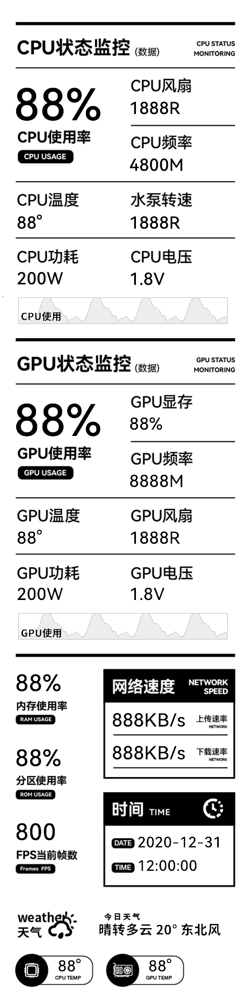

This project is basically equivalent to https://github.com/mathoudebine/turing-smart-screen-python, merging the modifications of https://github.com/phstudy/turing-smart-screen-python. Only the 8.8 v1.1 version is debugged. My running environment is Ubuntu 24.04 AMD R9 9950x + 7900XT. The rest of the code is AI + my own feeling.

## Running Options

### Running in the foreground

To run the application in the foreground:
```bash
sudo python3 main.py
# if venv is used
which python3
source venv/bin/activate
sudo xx/xx/turing-smart-screen-python/venxxx/bin/python3 main.py
```

### Running in the background

To run the application in the background:
```bash
./scripts/run_background.sh
```

To stop the background process:
```bash
./scripts/stop.sh
```

### Auto-start on system boot (systemd - Linux)

To install the application as a systemd service that starts automatically on boot:
```bash
./scripts/install_service.sh
```

After installation, you can control the service with:
```bash
# Start the service
sudo systemctl start turing-smart-screen

# Stop the service
sudo systemctl stop turing-smart-screen

# Restart the service
sudo systemctl restart turing-smart-screen

# Check service status
sudo systemctl status turing-smart-screen

# View logs
journalctl -u turing-smart-screen -f
```

To uninstall the service:
```bash
./scripts/uninstall_service.sh
```

### Desktop launcher (Linux)

To install a desktop launcher for easy access:
```bash
./scripts/install_desktop.sh
```

### Preview Turing Smart Screen 8.8"

